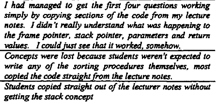
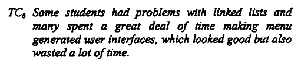
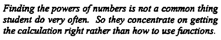
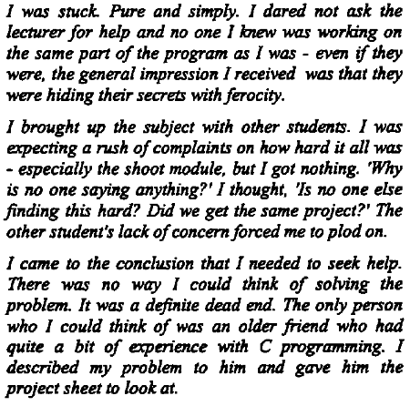

# Exercise formulation

Det kan være svært at lave opgaver til de studerende der går godt. De studerende kan misforstå, bruge tiden forkert, sidde fast og hvad ved jeg. Til at lave bedre opgaver har jeg undersøgt lidt

Her er noget af det jeg kæmper lidt med

- Jeg føler mit problem er at jeg leder for meget, holder for meget i hånden. 

- Jeg synes tit at de studerende misforstår og det er derfor jeg tit holder lidt meget i hånden for at sikre mig at de bruger tiden på det opgaven er tiltænkt. 

- Jeg laver ofte kode der sætter de studerende op så de er klar til en opgave, men det backfirer ofte. 

- Da opgaverne er mindre, er det vigtigt at de studerende bruger tiden rigtigt

-----

From Principles for designing programming exercises to minimise poor learning behaviours in students https://dl-acm-org.ez-kea.statsbiblioteket.dk:12048/doi/pdf/10.1145/359369.359374

There are 3 main habits/traits that act as barriers to quality learning. Superficial learning, impulsive attention and staying stuck. They will here be discussed

## Superficial learning

**Definition**: Skimming text without really gaining meaning from it. 

**Suggestions to improve**

- **Not always coding** - Make exercises that is not about coding fx tracing code, answering questions, writing pseudo code
- **Rewards for understanding** - Instead having the focus on completing all tasks, have it be on understanding of the material
- **Outline a method of attack** - How should the students start with solving the problem. The students can otherwise wander of a bad path
- **Smaller coding questions** - This avoids the students feeling pressured into copying

## Impulsive attention

**Definition**: Only parts of an exercise are attended but others are overlooked

Students spending time on the wrong thing, i think most teachers can relate with the following 👇

Tasks that do not emphasise the key concept and tasks that contained too many unfamiliar concepts lead to impulsive attention. 

**Suggestions to improve**

- **Emphasise the key point of the exercise** - Exactly what do you want the students to learn and focus on. Make it clear, write it down!
- **Provide adequate resources for the introduction of unfamiliar material** - Introducing new material is totally fine, but add good resources/documentation/stackoverflow answer that can help the students read up

## Staying stuck

**Definition**: Lack of strategy to cope with being stuck. Students being stuck with a problem and not being able to get them selves out of the mess. 

3 main ways of getting stuck

1. Does not know how to begin a task
2. Does not know how to design a solution in manageable components
3. Getting stuck at debuggin level

**Suggestions to improve**

- **Tactics on how to start with graded help** - Challenge a student first, dont challenge everything
- **Provide useful references and resources** - Maybe a quota question, stackoverflow answer, medium blog, youtube video
- **Provide guidelines on how to write and test code in manageable chunks** - Build a program in stages. If fx the task need to read a file first, then make that a seperate exercise

