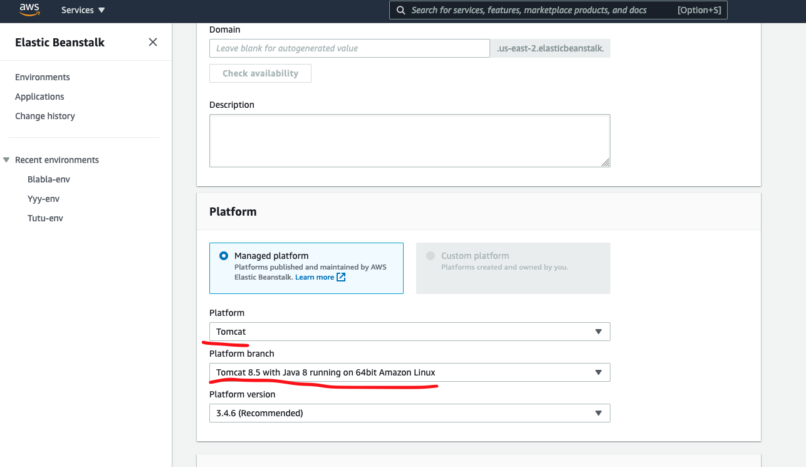
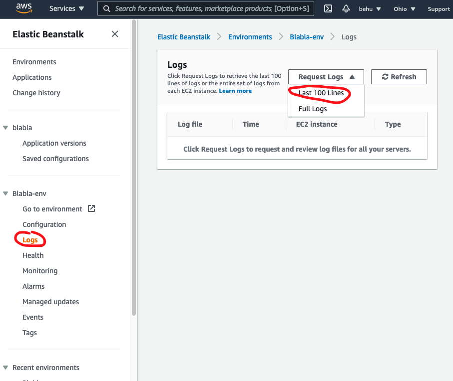
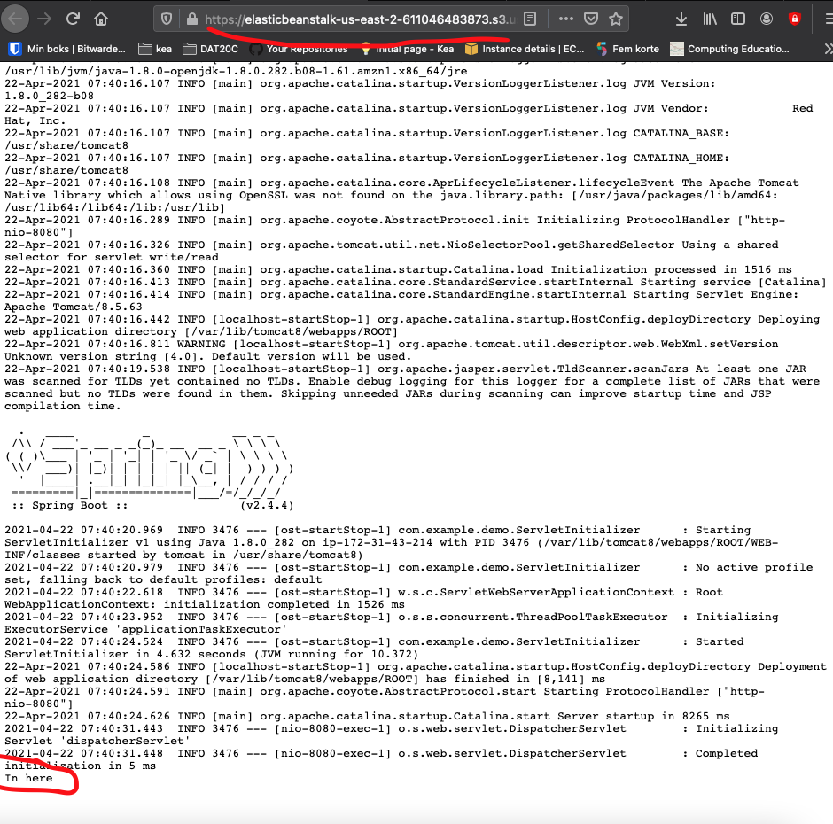
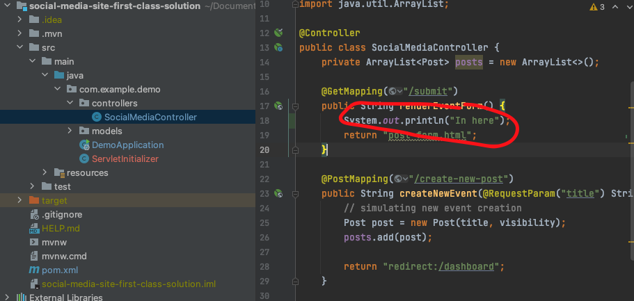

# Deploy Spring boot to AWS Beanstalk


AWS Beanstalk is an easier way to deploy web application and run web applicaitons. The developer does not need to manage databases, servers, upgrading packages etc. It's all done by Beanstalk


## Creating your first instance

There are two ways to deploy your Spring boot on AWS Beanstalk


### Deploying Spring boot using Java

Go to https://us-east-2.console.aws.amazon.com/elasticbeanstalk/home?region=us-east-2#/gettingStarted

Choose `Web server envirenment`

The platform should be  `Java`. As the application code upload a jar file👇


#### Creating a jar file

So in the `pom.xml` file, add the following 

````xml
<packaging>jar</packaging>
````

And remember the correct version of Java!

```xml
<properties>
    <java.version>1.8</java.version>
</properties>
```

Remember to rebuild your maven file now!

Now run this command to build the `jar` file: 

```bash
 ./mvnw package -DskipTests
```

The file will be added to the `target` folder as `APPLICATION_NAME-APPLICATION_VERSION.jar` fx `demo-1.jar` 

If this does not work follow this guide to create a `jar` file: https://www.jetbrains.com/help/idea/compiling-applications.html#package_into_jar

*For me when building the artifacts i could not select the jar artifact (in IntelliJ) with the mouse. Use the arrows instead*


#### Adding the right port

Now if you go to the application you will probably see a `502 bad gateway`, that is because beanstalk is listening on port 5000, but spring boot is running the application on 8080. 


To change that you can do one of these two things:

1. Add `server.port=5000` in your `application.properties` file. Remember to put the `application.properties` in the `/src/main/resources` folder
2. In the Configuration (in the left side of the site, maybe click the hamburger menu to open it). Click `Edit` at the Software category. In the Environment properties add `server.port` as Name and `5000` as Value


### Deploying Spring boot using Tomcat

Go to https://us-east-2.console.aws.amazon.com/elasticbeanstalk/home?region=us-east-2#/gettingStarted

Choose `Web server envirenment`

The platform should be  `Tomcat`. Now you need to upload the `war` file


#### Building the WAR file

Before we can build the `war` file we need the project set properly up! We need to add `ServletInitializer.java`. This will ensure that the `war` file is loaded correctly

Add a `ServletInitializer.java` in the folder that has the main java file. In my example the folder is called `src/main/java/com/example/demo`. 

**src/main/java/com/example/demo/ServletInitializer.java**

```java
package com.example.demo;

import org.springframework.boot.builder.SpringApplicationBuilder;
import org.springframework.boot.web.servlet.support.SpringBootServletInitializer;

public class ServletInitializer extends SpringBootServletInitializer {

    @Override
    protected SpringApplicationBuilder configure(SpringApplicationBuilder application) {
        return application.sources(DemoApplication.class);
    }

}
```

**Remember to change the `package` and the `DemoApplication` so it fits your program.** 

Instead of `DemoApplication` write the name of the main springboot class


In your `pom.xml` file add the following

```xml
<packaging>war</packaging>
```

Also remember to add the java version to your `pom.xml` file. 

```xml
<properties>
    <java.version>1.8</java.version>
</properties>
```

Now in IntelliJ when you go to `file -> Project structure -> artifacts` there should two: 

1. `PROJECTNAME:war`
2. `PROJECTNAME:war exploded`

If not you need to add them using the `+`


Now to build the `war` file click `Build -> Build Artifacts -> All Artifacts`

A new folder called `target` will be built, the `war` file to use is the file called `PROJECTNAME-VERSION.war` so fx `social-media-site-1.0.war`

This is the file to upload.


#### Seeing logs from the Spring boot application using Tomcat

If you use Tomcat as the platform then the logs you will se is from Tomcat **not** from the Spring boot application!

To see the logs from the Spring boot application create a new Beanstalk application and as the `Platform branch` select `Tomcat 8.5 with Java 8 running on 64bit Amazon Linux`





Now if you log something from your Spring boot application you will be able to see them in the logs:







The log is coming from here:




So if you get a 500 error message you need to go to the Beanstalk logs and find out what the problem is!


## See the logs

You can see the logs in the left side by clicking on Logs. In the top click `Request logs` the select `Last 100 lines` and `Download`


## Connecting a database

Before you connect to the database write this line

```java
try {
	Class.forName("com.mysql.jdbc.Driver");
} catch (ClassNotFoundException e) {
  System.out.println("Where is your MySQL JDBC Driver?");
  e.printStackTrace();
}
```

