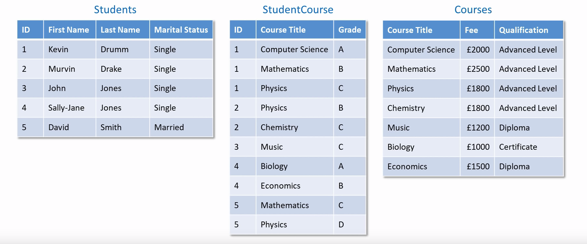

# Database normalization

Database normalisation is the process of structuring/restructuring your database tables so that redundancy within the tables is reduced

There are different forms of normalisation. We will here look at the first three forms of normalisation

## First normal form

Let's first go technical and then we can explain the technical term simple way

> - A table must not contain composite or multi-valued attributes
> - A table must not contain any repeating groups of attributes

1. The first normal form is about each field of a table can only contain one item
2. All of the data items in a column must mean the same thing
3. Each row of the table must be unique
4. A table must have no repeating columns

Put simply each cell must contain unique data, no repeating columns and each row must be unique

Here is an example of a table that is not in first normal form. See the course titles fx here there are multiple courses seperated with `,` (violating rule 1). Also the student name has multiple meanings, both name, a number and married (violating rule 2, its multivalued). There are also duplicate rows, row 2 and 6 (violating rule 3)

Let's improve this:

Now all rows and unique and each cell contains one piece of data

*From https://www.youtube.com/watch?v=jgUeOjImOOw*

## Second normal form

> - Data must be in first normal form
> - A relation must not contain any partial dependencies (we will get to this in the bottom!)

Put simply

- Each key field must be about the same thing as the primary key
- Each table must contain data about only one type of thing

Look at the table below:

We can immidiately see that there are data about multiple things:

- Student data (id, First Name, Last Name and Marital Status)
- Course data (Course Title, Fee and Qualifications)
- Grade (dependent on both ID and Course). A course if given for at student for a specific course

Imagine all the copying we are doing when adding a student joins a new course, then we again have to write the id, firstname, lastname and marital status. That's not good! 

So why is this not in second form??

Let's say you have to change the `ID`, now you also have to change the firstname, lastname and the marital status. This replationship if called **functional dependent**. 

**Partial dependency** - when an attribute is functionallly dependent on part of a table key. Fx In the table above first name is functionally dependent on ID. **But** there is another primary key, course title. First name is not functionally dependent on Course Title making it partially dependent! Therefore we have to break the table up

So let's fix it:

**Super important 👇**

In this solution every attribute of fx the students table are functionally dependent of the primary key (if you change the key you have to change the other attributes aswell) Technical: every non key attribute is functionally dependent of the primary key and **only** the primary key. There are no partial dependencies!

*From https://www.youtube.com/watch?v=_K7fcFQowy8*

## Third normal form

> - The data must be in second normal form
> - A relation has no transitive functional dependencies on the primary key. Put simply: There is no other non key attribute that you would need to change

What means transitive functional dependency. Lets look at this table:

Teacher ID is functionally dependent on Course Title (for a specific course there is a sepcific teacher). **But** Teacher Name is functionally dependent on Teacher id. That means that Teacher Id is through Teacher name dependent on Course Title. Something depends on something which again depends on something else. This relationship is called transitive dependency

Course title → Teacher ID → Teacher Name = transitive 

Lets fix the above table:

Now there are no transitive dependencies, but only functional dependencies. 