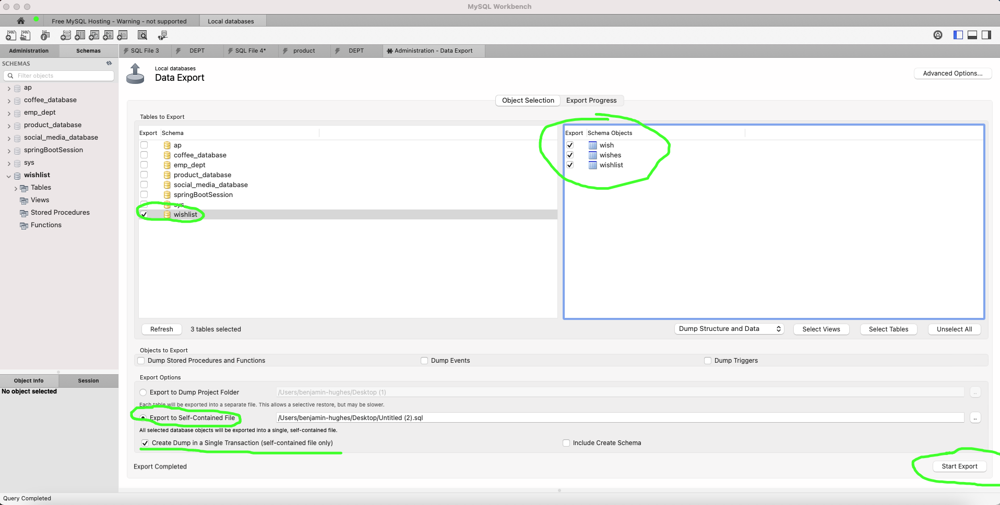

# Export and import sql datat from Workbench

## Export database

 Go to the database you wish to export now click `server -> Data export`

Tick off the database to choose and the tables. Select `Export to Self-contained File` and `Create Dump in a Single Transaction (self-container file only)`. To export click `Start export`

## Import database

Open the exported `sql` file in a text editor. 

Everywhere where it says `ENGINE=InnoDB AUTO_INCREMENT=19 DEFAULT CHARSET=utf8mb4 COLLATE=utf8mb4_0900_ai_ci` remove that!

In the `sql` file you might need to write `use DATABASENAME` where `DATABASENAME` is the database you need to add the data into!