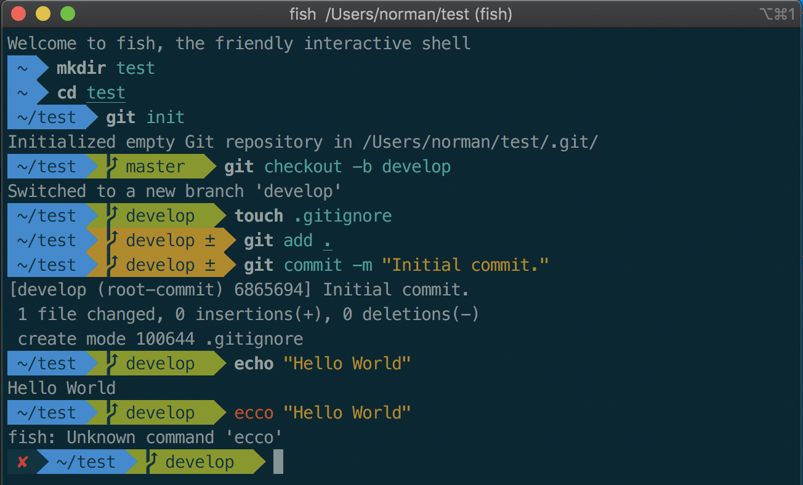

From https://gist.github.com/leymannx/598e0e92722f47cfb31daa7cf9f9a817

## Install [iTerm 2](https://www.iterm2.com)

Download, unzip and drag to your Applications directory.

https://www.iterm2.com/downloads.html

## Install [Fish](https://fishshell.com/docs/current/tutorial.html)

`brew install fish`

`echo "/usr/local/bin/fish" | sudo tee -a /etc/shells`

iTerm2 > Preferences > Profiles > General > Basics / Name: fish > Command: /usr/local/bin/fish

Restart iTerm2

## Install [oh-my-fish](https://github.com/oh-my-fish/oh-my-fish)

`curl -L https://github.com/oh-my-fish/oh-my-fish/raw/master/bin/install | fish`

## Install oh-my-fish [agnoster package](https://github.com/oh-my-fish/oh-my-fish/blob/master/docs/Themes.md#agnoster)

`omf install agnoster`

Restart iTerm2

## [Powerline fonts](https://github.com/powerline/fonts)

`git clone https://github.com/powerline/fonts.git --depth=1`

`cd fonts`

`./install.sh`

`cd ..`

`rm -rf fonts`

iTerm2 > Preferences > Profiles > Text > Font > Change Font > 14pt Meslo LG M Regular for Powerline

Restart iTerm2

## [Solarized](http://ethanschoonover.com/solarized) Dark iTerm2 theme

Save Link As ... > https://raw.githubusercontent.com/mbadolato/iTerm2-Color-Schemes/master/schemes/Solarized%20Dark%20-%20Patched.itermcolors

Double Click

iTerm2 > Preferences > Profiles > Colors > Color Presets > Solarized Dark - Patched

Restart iTerm2

## Credits

https://jmolivas.weknowinc.com/improve-your-shell-using-fish-and-oh-my-fish

https://gist.github.com/kevin-smets/8568070

http://ethanschoonover.com/solarized

https://github.com/oh-my-fish/oh-my-fish/blob/master/docs/Themes.md#agnoster

https://fishshell.com/docs/current/tutorial.html

https://fishshell.com/docs/current/index.html