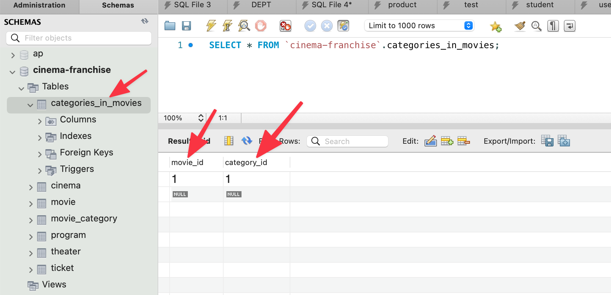
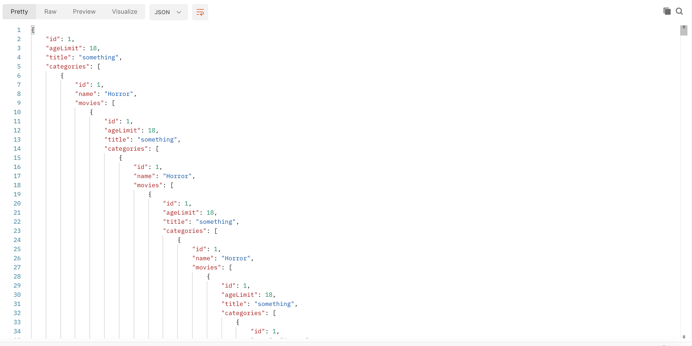
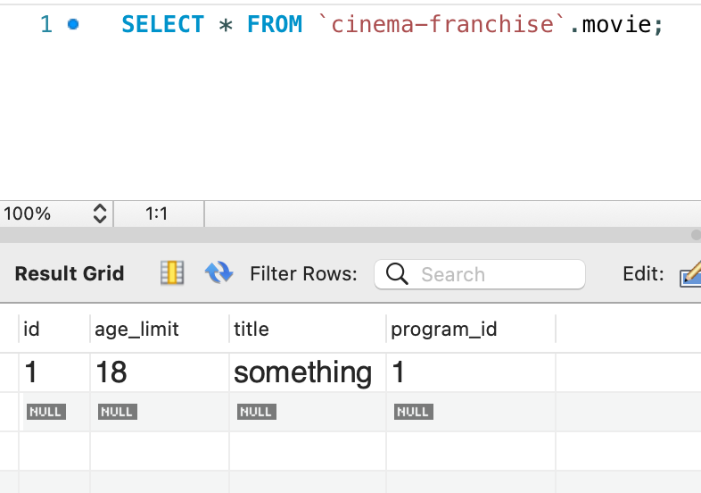

# Spring data JPA

JPA stands for Java persistence API

Hipernate is the most popular implementation of JPA. It takes a Java class that is mapped to our database using an ORM. 

Spring Data JPA is an abstraction on top of Hibernate and JPA which makes it easy to work with application that talks to the database. We can work with sql through just working with the objects. 

Basiscally Data JPA works by the developer working with Java objects, these objects are mapped to a database and therefore fx creating a new object will make an `INSERT INTO` sql query inserting that object. Now we can significantly reduce the number of sql queries we are writing


## Installing Data JPA

Add this to your maven file

```xml
<dependency>
    <groupId>org.springframework.boot</groupId>
    <artifactId>spring-boot-starter-data-jpa</artifactId>
</dependency>
<dependency>
     <groupId>mysql</groupId>
     <artifactId>mysql-connector-java</artifactId>
</dependency>
```

Your `application.properties` file should look like this. Adding the correct database url and username and password!

```java
spring.datasource.url=jdbc:mysql://localhost:3306/jpa-data
spring.datasource.username=
spring.datasource.password=
spring.jpa.hibernate.ddl-auto=create-drop
spring.jpa.show-sql=true
spring.jpa.properties.hibernate.dialect=org.hibernate.dialect.MySQL5InnoDBDialect
spring.jpa.properties.hibernate.format_sql=true
```

The other configurations are not relevant for now. 


## Mapping a `Class` to a `table`

Create a new class and then add an annotation called `@Entity(name = "TABLE_NAME")` (using the `javax.persistence.Entity`)

This will make the class into a table in your database. 

You have to remember to tell JPA which field is the primary key. We do this with the `@id` annotation 

````java
import javax.persistence.Entity;
import javax.persistence.Id;

@Entity(name = "Student")
public class Student {
    @Id
    private Long id;
    private String firstName;
    private String lastName;
    private String email;
  	....
````

When we run the query now, we can see the output from Hibernate:

```
Hibernate: 
    
    create table student (
       id int8 not null,
        age int4,
        email varchar(255),
        first_name varchar(255),
        last_name varchar(255),
        primary key (id)
    )
```

This is because we have this setting in the application.properties:

```
spring.jpa.show-sql=true
```


### Autoincrement id

```java
@Entity(name = "cinema")
public class Cinema {
    @Id
    @GeneratedValue(strategy = GenerationType.IDENTITY)
    @Column(name = "id", nullable = false)
    private Long id;
    private String name;
    private String website;
}
```


## Controlling column information

Sometime we want to add information to a column like the name of the column, the type, if it can be `NULL` etc. We do this with the `@Column` annotation


````java
@Entity(name = "Student")
public class Student {
    @Id
    private Long id;
  	@Column (
      	// the specific column name
        name="first_name",
      	// cannot be NULL
        nullable = false,
      	// the type
        columnDefinition = "TEXT"
    )
    private String firstName;
````

The `@Column` annotation takes some different arguments, like the name of the column, `nullable` etc


## Repositories

The repository is the layer that actually performs the sql queries to fx get a `Student` or delete a `Student`. 

It works by making a new `interface` that extends `JpaRepository` that has methods for getting, creating, deleting etc. 


To get the functionality provided in the CRUD create a new `interface` that extends `extends JpaRepository`. This extension need two types! Firstly the type of the class that will be interacted with, in this example `Student` the second argument is the type of the id!

```java
import org.springframework.data.jpa.repository.JpaRepository;

public interface StudentRepository extends JpaRepository<Student, Long> {

}
```


Now you can use the methods as follows:

```java
@Controller
public class StudentController {
    @Autowired
    StudentRepository studentRepository;

    @GetMapping("/")
    @ResponseBody
    public String getIndex() {
        Student benjamin = new Student(new Long(1), "asd", "asd", "asd", 2);
        studentRepository.save(benjamin);
        return "";
    }
}
```


## Relationships

In a database you can have quite a lot of different relationships. Fx one to one, one to many, many to many. This part will be about how to set that up


### Many to many

Let's use the example of a movie having multiple categories and a category having multiple movies. 

**`Movie`**

```java
@ManyToMany
@JoinTable(
  name = "categories_in_movies",
  joinColumns = @JoinColumn(name = "movie_id"),
  inverseJoinColumns = @JoinColumn(name = "category_id")
)
private Set<MovieCategory> categories = new HashSet<>();
```

To create a many to many relationship, we need a third table holding what categories is connected to what movies. We do that with `@JoinTable`. It takes a name, a join column and the column to other reference (`movie_id` and `category_id`)





**`MovieCategory`**

```java
@JsonBackReference
@ManyToMany(mappedBy = "categories")
private Set<Movie> movies = new HashSet<>();
```

In the `MovieCategory` we need to tell where the movies can be found, from a category perspective. We do that with `mappedby`. Here we to reference the **object name** which in `Movie` is called `categories`!


`JsonBackReference` will stop the recursive nature of fx showing a movie and then showing that movies categories, then showing the movies connected to that category and so on. `@JsonBackReference` will do so that `MovieCategory` has no `movies` attribute. They are simply not shown!



Here we see the recursive problem with not having `JsonBackReference`


## One to many

Let's go with the example of one can belong to a program but a program can have multiple movies


**`Program`**

```java
@OneToMany(mappedBy = "program")
private Set<Movie> movies = new HashSet<>();
```

So here we use the `OneToMany` since one program can have multiple movies connected. `program` refers to the object in `Movie` seen below


**`movie`**

On the movie side of things we can write 

```java
@ManyToOne(cascade = CascadeType.ALL)
@JoinColumn(name = "program_id", referencedColumnName = "id")
private Program program;
```

`ManyToOne` is written because there are many movies and they all have just one program. Or more many movies can belong to one program.

This part:`@JoinColumn(name = "program_id", referencedColumnName = "id")` will create a new column in movies where `program_id` refers to the `id` of a `Program`




## Gotchas

- If you return a object in a RestController but are not seeing any data in the json. Then remember to give the class setters for the attributes you want to see!
- No `-` in the sql names! `categories-in-movies` should be `categories_in_movies`


## Questions

- I have movies and categories. I want a movie to show what categories is connected to the movie. But also show what movies are in what categories. I dont seem to be able to fix this. I have tried `@JsonIgnore` and `@JsonBackReference` Fixer med DTO
- Hvad hører til hvad. Hvor er det man skal lave `mappedBy` og hvor skal man lave `JoinColumn` og `JoinTable`? Altså hvor skal data høre join column høre til. Det har jo nok noget at gøre medhvor man skal bruge det. **Det kommer an på usecasen. Det gør typisk ikke den store forskel** 
- 
