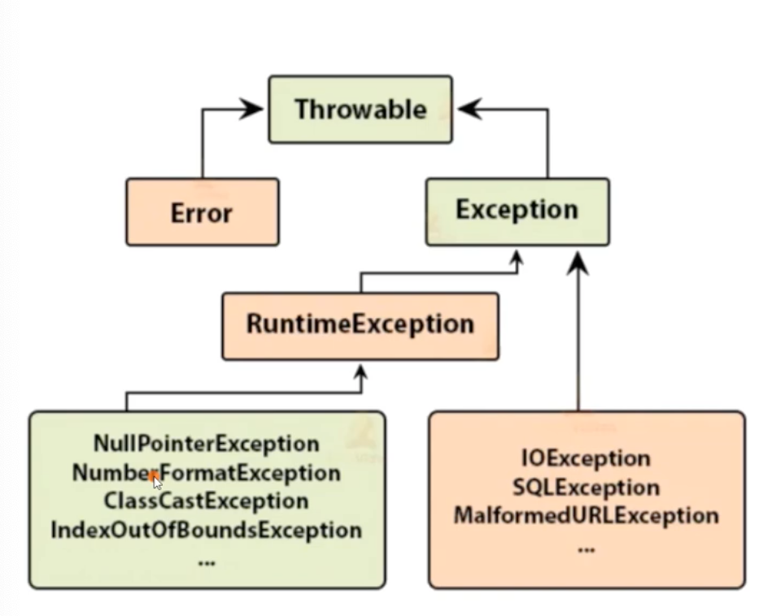
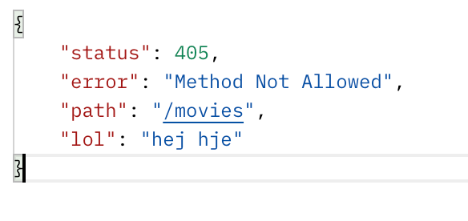

# Errors

Based on https://www.youtube.com/watch?v=bzGKeIcYOZs




There are some different types of errors:

- `Error` - very serious errors that will probably result in the application closing. Its things like memory overflow
- `Exception` - Is a bit more mild. It could be things like could not find a file fx. This a user could maybe fix if we ask the user to put in another filename.
- `RuntimeException` - A bit more serious. This a user could not fix. Its typically a result of a bug in the code.


## Checked exceptions

Exceptions we as programmers have to handle in some way because of the way Java has been designed. Here we handle the exception directly.

```java
public void checkedExceptionDemo() {
  File file = new File("I dont exists");
	try {
		Scaner scanner = new Scanner(file);
	} catch (FileNotFoundException e) {
		System.out.println("File not found");
	}
}

public void run() throws exception {
  try {
    checkedExceptionDemo();
  // Dont do this in a real life scenario
  } catch(Throwable e) {
  	System.out.println(e.getClass() + ": " + e.getMessage());
  }
}
```

We could also handle the error this way:

```java
public void checkedExceptionDeom() throws FileNotFoundException {
  File file = new File("I dont exists");
	Scaner scanner = new Scanner(file);
}
```

Here if an error occurs, the function we created throws an error. Now when using this method it need to be wrapped in try catch, or again thrown up the chain


## Runtime exception

```java
String name = "peter";
name = null;
System.out.println(name.length());
```

`NullPointerException` thrown here. 


## Own exception

Let's create and throw our own exception

```java
class MyException extends RuntimeException {
	public MyException(String message) {
		super(message);
	}
}

class Test {
  public void throwMessage() {
    throw new MyException("My exception");
  }
}
```


## Rest error handling


2 types of errors:

1. The client makes a call the rest api is not ready for
2. The backend business logic fucks up


Don not pass the original exception object


The rest api should always return the http status code

- 400 - client issue
- 500 - server issue


## Creating your own errors in spring boot

To see error messages in spring boot add this to the `application.properties`: `server.error.include-message=always`

```java
@Component
public class CustomErrorAttributes extends DefaultErrorAttributes {
    @Override
    public Map<String, Object> getErrorAttributes(WebRequest request, ErrorAttributeOptions options) {
        // Let Spring handle the error first, we will modify later :)
        Map<String, Object> errorAttributes = super.getErrorAttributes(request, options );

        errorAttributes.remove("timestamp"); //Get rid of the timestamp
      	errorAttributes.put("lol", "hej hje");
        return errorAttributes;
    }
}
```


Creae a class that extends `DefaultErrorAttributes`. Now `@override` the `getErrorAttributes`. 




### Creating custom error

you can create your own custom error like this:

```java
@ResponseStatus(value = HttpStatus.NOT_FOUND)
public class NotFoundException extends RuntimeException {
    public NotFoundException(String message) {
        super(message);
    }
}
```


### ResponseStatusException

You can also just  `throw new ResponseStatusException(HttpStatus.NOT_FOUND, "No name found for: " + id)`;

Here is an example of not being able to find a movie category: 

```java
@GetMapping("movie-categories/{id}")
    public MovieCategory getCategoryMovie(@PathVariable Long id) {
        return movieCategoryRepository.findById(id).orElseThrow(() -> new ResponseStatusException(HttpStatus.NOT_FOUND, "No name found for: " + id));
    }
```

