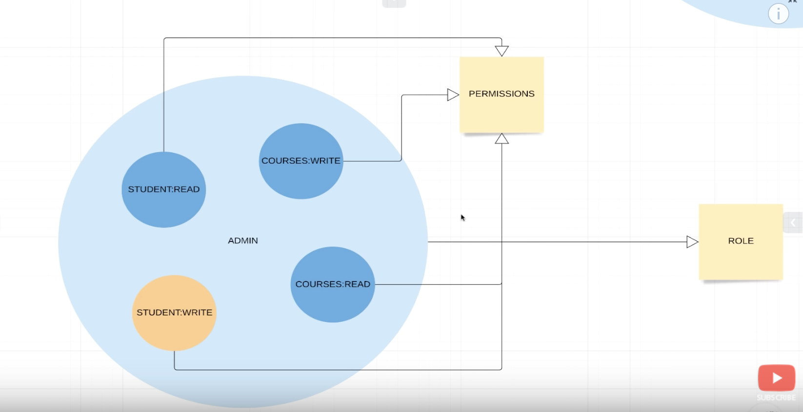
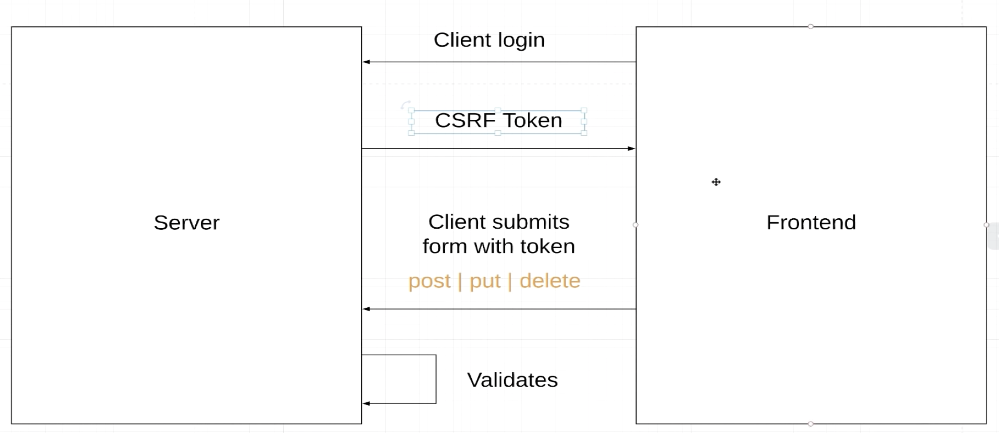
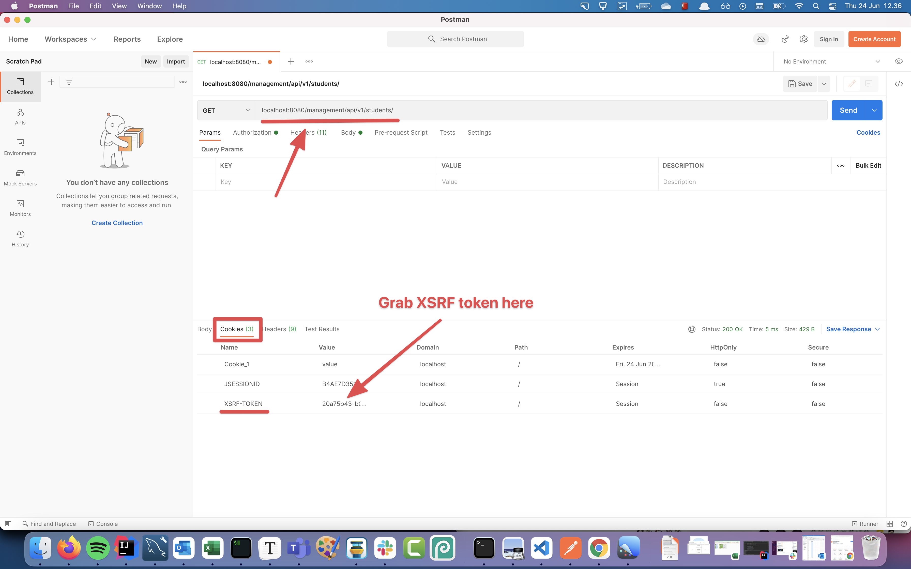
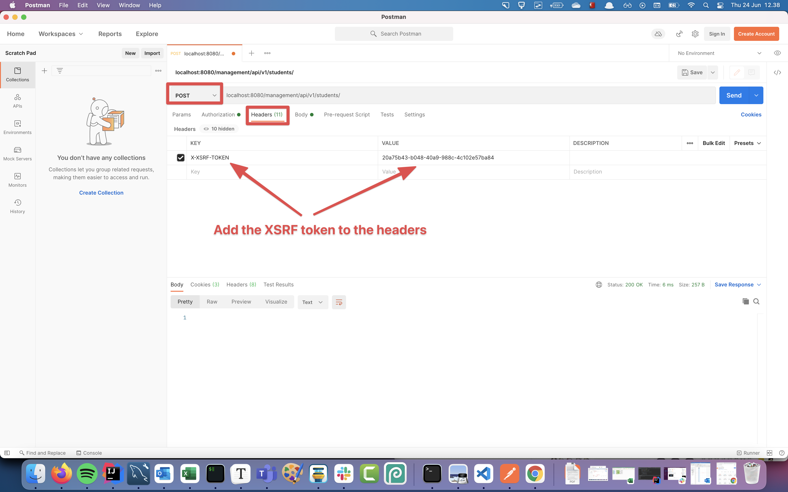
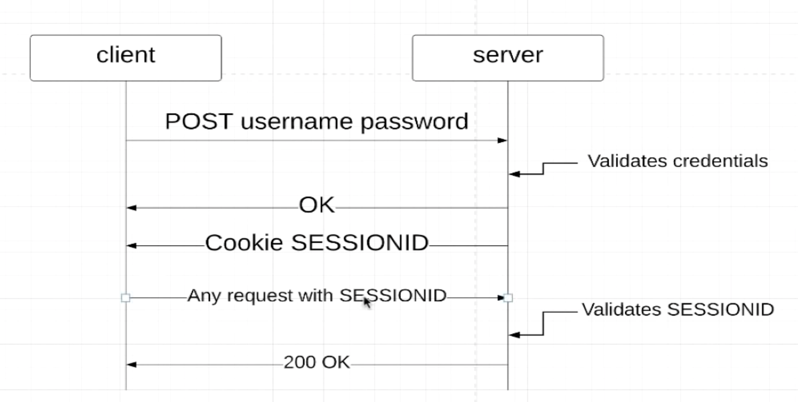

# Spring security

This documentation has been written following this video course: https://www.youtube.com/watch?v=her_7pa0vrg


Spring security enables us to secure our application. It is sespecially useful for things like login, user creation, user authentification, etc.

Spring Security works by creating a class that `extends` the `WebSecurityConfigurerAdapter`. You then override methods to achieve functionality.


## Install Spring Security

Add this dependency to install Spring Security

```xml
<dependency>
   <groupId>org.springframework.boot</groupId>
   <artifactId>spring-boot-starter-security</artifactId>
</dependency>
```

Now you get a login authentication box after it has been installed. 

To log in, the username is `user` and the password will appear in the terminal when running the application!


## Basic authentication

When a client needs to access a page he sends the username and the password in the request header

Create a new `Class` that extends `WebSecurityConfigurerAdapter`. Also add the annotations `@Configuration` and `@EnableWebSecurity`.

```java
@Configuration
@EnableWebSecurity
public class ApplicationSecurityConfig extends WebSecurityConfigurerAdapter {
    @Override
    protected void configure(HttpSecurity http) throws Exception {
        http
                .authorizeRequests()
                .anyRequest()
                .authenticated()
                .and()
                .httpBasic();
    }
}
```

Here we extend `WebSecurityConfigurerAdapter` and override the `configure` method

- `http` is an object of `HttpSecurity` that we can use to cofigure things
- `authorizeRequests` - we want to authorize requests
- `anyRequest` - all requests must be authorised. The client must specify username and password
- `authenticated` - The requests must be authenticated
- `httpBasic` - this is the authentication method (basic authentication). There are others like fx JWT. But here we are using basic authentication

There will now be a popup from the browser where you need to log in


## Ant matchers, whitelist pages

Sometimes there are pages that should be public. Fx `/` or js files/css files. For that we use `antMatchers`

```java
http
        .authorizeRequests()
        .antMatchers("/", "index", "/css/*", "/js/*")
        .permitAll()
        .anyRequest()
        .authenticated()
        .and()
        .httpBasic();
```

With `antMatchers` we can add the patterns to exclude. But we need to say after the pattern `permitAll`. 


## Working with users

To start working with users we need to overwrite the `UserDetailsService`method.

```java
@Override
@Bean
protected UserDetailsService userDetailsService() {
  UserDetails annaSmithUser = User.builder()
    .username("annasmith")
    .password(new BCryptPasswordEncoder().encode("password"))
    .roles("STUDENT") // internally ROLE_STUDENT
    .build();

  return new InMemoryUserDetailsManager(annaSmithUser);
}
```

Here we give the user Anna Smith a username and a password. Remember the password has to be encoded using BCrypt!


## Roles

A role can have different permissions. That is illustrated in this graphic below. Where a `ADMIN` role has permissions to read and write to a course and a student. 





Here is another role the student with different permissions. Fx the student cannot write to a course!


An example of this is an api that where access is limited to some users. So some endpoints will need a specific role. 


## Role based authentication

When creating the users, you can specify the roles:

```java
UserDetails annaSmithUser = User.builder()
        .username("annasmith")
        .password(new BCryptPasswordEncoder().encode("password"))
        .roles("STUDENT") // internally ROLE_STUDENT
        .build();
```


Now in the `ApplicationSecurityConfig.java` we can tell that specific roles have access to some endpoints: 

```java
http
    .authorizeRequests()
    .antMatchers("/", "index", "/css/*", "/js/*").permitAll()
    .antMatchers("/api/**").hasRole("STUDENT")
    .anyRequest()
    .authenticated()
    .and()
    .httpBasic();
```


## Adding authority to users

Remember that to make this work for now, disable CSRF:

```java
http
    .csrf().disable()
    .authorizeRequests()
    .antMatchers("/", "index", "/css/*", "/js/*").permitAll()
    ...
```

BUT remember to enable it later when you know about CSRF!!! Otherwise your site wont be secure!


So far we have only given `roles` to users, let's look at how to add authority to users

```java
Set<SimpleGrantedAuthority> authorities = Sets.newHashSet(new SimpleGrantedAuthority("course:read"), new SimpleGrantedAuthority("student:write"));


UserDetails annaSmithUser = User.builder()
    .username("annasmith")
    .password(new BCryptPasswordEncoder().encode("password"))
    .authorities(authorities)
    .build();
```

You add authorities to users, bu using the `.authorities` method. When calling this method you need to give is a `List` of `SimpleGrantedAuthority` objects. The `SimpleGrantedAuthority` takes a `String` which is the name of the authority.


## Permission/authority based authentication

Two ways to to permission based authentication. Either with `antMatchers` or inline with annotations. 


### `antMatchers`

Here we add `antMatchers` for specific request types

```java
.antMatchers(HttpMethod.DELETE, "/management/api/**").hasAuthority("course:write")
.antMatchers(HttpMethod.POST, "/management/api/**").hasAuthority("course:write")
.antMatchers(HttpMethod.PUT, "/management/api/**").hasAuthority("course:write")
.antMatchers(HttpMethod.GET, "/management/api/**").hasAuthority("course:read")
```

The order of the `antMatchers` matter. It takes the first one then the next etc. 


### Inline annotation authority permissions

We can add annotations inline in our controller to specify who has access to what. To make this work first add the `@EnableGlobalMethodSecurity(prePostEnabled = true)` annotation before the `ApplicationSecurityConfig` file.

```java
@Configuration
@EnableWebSecurity
@EnableGlobalMethodSecurity(prePostEnabled = true)
public class ApplicationSecurityConfig extends WebSecurityConfigurerAdapter {
    private final PasswordEncoder passwordEncoder;
		...
```


Now in the controller both roles and authorities can be used using the `@PreAuthorize` annotation. Here is an example with checking the role `hasAnyRole`

```java
@GetMapping
@PreAuthorize("hasAnyRole('ROLE_ADMIN', 'ROLE_ADMINTRAINEE')")
public static List<Student> getAllStudents() {
    return STUDENTS;
}
```


Here is an example using authority using `hasAuthority`

```java
@PostMapping
@PreAuthorize("hasAuthority('student:write')")
public void registerNewStudent(@RequestBody Student student) {
    System.out.println("register");
    System.out.println(student);
}
```


## CSRF

CSRF stands for cross site request forgery. It means the action of forging a copy or imitation of a document/signature/banknote. https://www.youtube.com/watch?v=eWEgUcHPle0


To fix this problem the server will send a CSRF token on login. Now on every request the client will send that token. The server will then validate that token.




### Generate CSRF token

Add this to the `ApplicationSecurityConfig` file 👇

```java
http
   .csrf().csrfTokenRepository(CookieCsrfTokenRepository.withHttpOnlyFalse())
    .and()
    .authorizeRequests()
  	... 
```

This will send a CSRF token on every request. This token then needs to be sent back on every request.


#### Getting the CSRF token

In Postman to get the CSRF token, first make a `GET` request to `localhost:8080/management/api/v1/students/`. Then under `Cookies` look after the `XSRF-TOKEN`




#### Sending request with token

Now add the XSRF token to the request headers. 




## Form based authentication

In form based authentication the client `post`'s the username and password. The server then validatest those credentials and sends back a cookie `SESSIONID`. This `SESSIONID` should then be attached to every request when requesting something from the client.

 


Now instead of 

```java
.and()
.httpBasic();
```

Write 

```java
.and()
.formLogin();
```

Now you should see the login page. 


## Custom login page

To create a login page add this to the `http` object in the `ApplicationSecurityConfig` file.

```
.and()
.formLogin()
.loginPage("/login");
```


Add thymeleaf to the project in the `pom.xml` file

```
<dependency>
   <groupId>org.springframework.boot</groupId>
   <artifactId>spring-boot-starter-thymeleaf</artifactId>
</dependency>
```

Create a new folder under `resources` folder called **exactly** `templates`

Create a new `login.html` file in the `templates` folder

```html
<!DOCTYPE html>
<html lang="en">
<head>
    <meta charset="UTF-8">
    <title>Title</title>
</head>
<body>
	<h1>Login here!</h1>
</body>
</html>
```

Now create a new controller called `TemplateController` in a new package called `controller` under `com.example.demo` or whatever yours is called.


**TemplateController.java**

```java
package com.example.demo.controller;

import org.springframework.stereotype.Controller;
import org.springframework.web.bind.annotation.RequestMapping;

@Controller
@RequestMapping("/")
public class TemplateController {
    public String getLoginView() {
        return "login";
    }
}
```


**login.html**

```html
<!DOCTYPE html>
<html lang="en">
<head>
    <meta charset="UTF-8">
    <title>Title</title>
</head>
<body>
<h1>Login here!</h1>

<form class="form-signin" method="post" action="/login">
    <h2 class="form-signin-heading">Please sign in</h2>
    <p>
        <label for="username" class="sr-only">Username</label>
        <input type="text" id="username" name="username" class="form-control" placeholder="Username" required="" autofocus="">
    </p>
    <p>
        <label for="password" class="sr-only">Password</label>
        <input type="password" id="password" name="password" class="form-control" placeholder="Password" required="">
    </p>
    <button class="btn btn-lg btn-primary btn-block" type="submit">Sign in</button>
</form>
</body>
</html>
```

