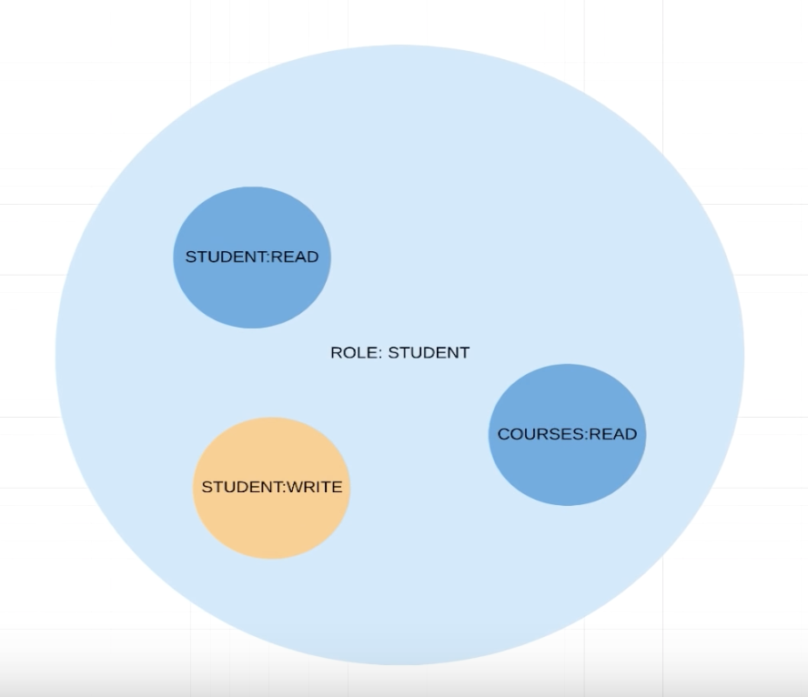

# Spring security

Spring security enables us to secure our application. It is sespecially useful for things like login, user creation, user authentification, etc.

Spring Security works by creating a class that `extends` the `WebSecurityConfigurerAdapter`. You then override methods to achieve functionality.


## Install Spring Security

Add this dependency to install Spring Security

```xml
<dependency>
   <groupId>org.springframework.boot</groupId>
   <artifactId>spring-boot-starter-security</artifactId>
</dependency>
```

Now you get a login authentication box after it has been installed. 

To log in, the username is `user` and the password will appear in the terminal when running the application!


## Basic authentication

When a client needs to access a page he sends the username and the password in the request header

Create a new `Class` that extends `WebSecurityConfigurerAdapter`. Also add the annotations `@Configuration` and `@EnableWebSecurity`.

```java
@Configuration
@EnableWebSecurity
public class ApplicationSecurityConfig extends WebSecurityConfigurerAdapter {
    @Override
    protected void configure(HttpSecurity http) throws Exception {
        http
                .authorizeRequests()
                .anyRequest()
                .authenticated()
                .and()
                .httpBasic();
    }
}
```

Here we extend `WebSecurityConfigurerAdapter` and override the `configure` method

- `http` is an object of `HttpSecurity` that we can use to cofigure things
- `authorizeRequests` - we want to authorize requests
- `anyRequest` - all requests must be authorised. The client must specify username and password
- `authenticated` - The requests must be authenticated
- `httpBasic` - this is the authentication method (basic authentication). There are others like fx JWT. But here we are using basic authentication

There will now be a popup from the browser where you need to log in


## Ant matchers, whitelist pages

Sometimes there are pages that should be public. Fx `/` or js files/css files. For that we use `antMatchers`

```java
http
        .authorizeRequests()
        .antMatchers("/", "index", "/css/*", "/js/*")
        .permitAll()
        .anyRequest()
        .authenticated()
        .and()
        .httpBasic();
```

With `antMatchers` we can add the patterns to exclude. But we need to say after the pattern `permitAll`. 


## Working with users

To start working with users we need to overwrite the `UserDetailsService`method.

```java
@Override
@Bean
protected UserDetailsService userDetailsService() {
  UserDetails annaSmithUser = User.builder()
    .username("annasmith")
    .password(new BCryptPasswordEncoder().encode("password"))
    .roles("STUDENT") // internally ROLE_STUDENT
    .build();

  return new InMemoryUserDetailsManager(annaSmithUser);
}
```

Here we give the user Anna Smith a username and a password. Remember the password has to be encoded using BCrypt!


## Roles

A role can have different permissions. That is illustrated in this graphic below. Where a `ADMIN` role has permissions to read and write to a course and a student. 


Here is another role the student with different permissions. Fx the student cannot write to a course!




An example of this is an api that where access is limited to some users. So some endpoints will need a specific role. 

