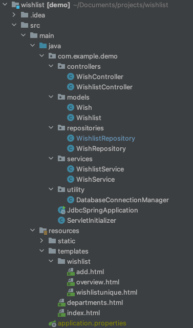

# Structuring your Spring boot application


There are lots and lots of ways to structure your spring boot application. I will cover two different ways


## Structure 1

In this structure there are 4 different packages:

1. **Controller** - Handles requests and invokes templates. The controller communicates with services
2. **Services** - The business layer. Interacts with the repositories
3. **Model** - Here we have the models in the application. The models are classes that contain data and operations on the data
4. **Repositories** - Handles persistence. Interacts with the database


This is how the structure looks




Here is an example of a project made with this structure: https://github.com/behu-kea/wishlist


**Controller example**

```java
@Controller
public class WishlistController {
    @Autowired
    WishlistService wishlistService;

    @GetMapping("/wishlist/add")
    public String addWishlistGetRequest() {
        return "wishlist/add.html";
    }

    @PostMapping("/wishlist/add")
    public String addWishlistPostRequest(@RequestParam("title") String title) {
        wishlistService.createWishlist(title);

        return "redirect:/wishlist/overview";
    }

    @GetMapping("/")
    public String wishlistOverview(Model model) {
        model.addAttribute("allWishlists", wishlistService.getAllWishlists());

        return "wishlist/overview.html";
    }

    @GetMapping("/wishlist/{id}")
    @ResponseBody
    public String getWishlist(@PathVariable("id") int id) {
        return wishlistService.getWishlist(id).toString();
    }
}

```


**Service example**

```java
@Service
public class WishlistService {
    @Autowired
    private WishlistRepository wishlistRepository;

    public void createWishlist(String title) {
        wishlistRepository.createWishlist(title);
    }

    public Wishlist getWishlist(int id) {
        return wishlistRepository.getWishlist(id);
    }

    public ArrayList<Wishlist> getAllWishlists() {
        return wishlistRepository.getAllWishlists();
    }
}

```


**Model example**

```java
public class Wishlist {
    private String title;
    private int id;
    private ArrayList<Wish> wishes;

    public Wishlist(int id, String title, ArrayList<Wish> wishes) {
        this.id = id;
        this.title = title;
        this.wishes = wishes;
    }

    public int getId() {
        return id;
    }

    public void setId(int id) {
        this.id = id;
    }

    public String getTitle() {
        return title;
    }

    public void setTitle(String title) {
        this.title = title;
    }

    public ArrayList<Wish> getWishes() {
        return wishes;
    }

    public void setWishes(ArrayList<Wish> wishes) {
        this.wishes = wishes;
    }

    @Override
    public String toString() {
        return "Wishlist{" +
                "title='" + title + '\'' +
                ", id=" + id +
                '}';
    }
}
```


**Repository example**

```java
@Repository
public class WishlistRepository {
    @Autowired
    DatabaseConnectionManager databaseConnectionManager;

    public void createWishlist(String title) {
        try {
            Connection conn = DriverManager.getConnection(databaseConnectionManager.getUrl(), databaseConnectionManager.getUser(), databaseConnectionManager.getPassword());
            Statement st = conn.createStatement();
            st.executeUpdate("insert into wishlist(title) VALUES('" + title + "');");
            conn.close();
        }
        catch(SQLException e){
            System.out.println("Something went wrong");
            System.out.println(e.getMessage());
        }
    }

    public Wishlist getWishlist(int id) {
        Wishlist wishlist = null;

        try {
            Connection conn = DriverManager.getConnection(databaseConnectionManager.getUrl(), databaseConnectionManager.getUser(), databaseConnectionManager.getPassword());

            PreparedStatement stmt = conn.prepareStatement("SELECT * FROM wishlist where id ='" + id + "'");
            ResultSet rs = stmt.executeQuery();
            while(rs.next()){
                int wishlistId = rs.getInt(1);

                ArrayList<Wish> wishesForWishlist = getWishesForWishlist(wishlistId);

                wishlist = new Wishlist(
                        rs.getInt(1),
                        rs.getString(2),
                        wishesForWishlist
                );

                System.out.println(wishlist);
            }
            conn.close();
        }
        catch(SQLException e){
            System.out.println("Something went wrong");
            System.out.println(e.getMessage());
        }

        return wishlist;
    }
}
```


## Structure 2

Structure 2 has a different approach. The controller works the same way as in structure 1, handling requests. 


There are 3 packages in this structure:

- **Controller** - Has the controllers that handles requests and templates
- **Data** - Contains classes relevant for accessing data from the database
- **Domain** - Contains classes relevant for the domain of the application. Fx a `User` class or a `Product` class. 


In the packages there are different kinds of files:

**Data package**

Mapper file, fx `UserMapper` - Interacts with the database. Here is an example:

```java
public class UserMapper {

    public void createUser(User user) throws LoginSampleException {
        try {
            Connection con = DBManager.getConnection();
            String SQL = "INSERT INTO Users (email, password, role) VALUES (?, ?, ?)";
            PreparedStatement ps = con.prepareStatement(SQL, Statement.RETURN_GENERATED_KEYS);
            ps.setString(1, user.getEmail());
            ps.setString(2, user.getPassword());
            ps.setString(3, user.getRole());
            ps.executeUpdate();
            ResultSet ids = ps.getGeneratedKeys();
            ids.next();
            int id = ids.getInt(1);
            user.setId(id);
        } catch (SQLException ex) {
            throw new LoginSampleException(ex.getMessage());
        }
    }

    public User login(String email, String password) throws LoginSampleException {
        try {
            Connection con = DBManager.getConnection();
            String SQL = "SELECT id, role FROM Users "
                    + "WHERE email=? AND password=?";
            PreparedStatement ps = con.prepareStatement(SQL);
            ps.setString(1, email);
            ps.setString(2, password);
            ResultSet rs = ps.executeQuery();
            if (rs.next()) {
                String role = rs.getString("role");
                int id = rs.getInt("id");
                User user = new User(email, password, role);
                user.setId(id);
                return user;
            } else {
                throw new LoginSampleException("Could not validate user");
            }
        } catch (SQLException ex) {
            throw new LoginSampleException(ex.getMessage());
        }
    }
}
```


Spørgsmål:

- Er de studerende blevet sat ind i den her struktur?
- DataFacadeImpl er jeg ikke helt med på


